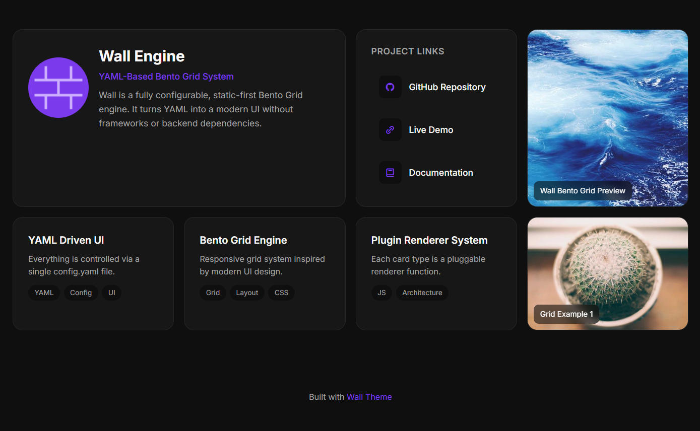

<p align="center">
  
  <h1 align="center">Wall</h1>
</p>

<p align="center">
  YAML ile yönetilen, statik ve modüler bir Bento Grid portfolio sistemi.
</p>

Wall, tek bir `config.yaml` dosyasından modern bir portfolio arayüzü üretir. Backend, build adımı veya framework gerektirmez; sayfa tarayıcıda YAML dosyasını okur, kartları oluşturur ve temayı CSS değişkenleriyle uygular.

---

## Özellikler

Wall'de sayfanın içeriği `config.yaml` dosyasındaki birkaç ana bölümle tarif edilir:

- **`profile`:** Hero kartında görünen isim, başlık, açıklama, avatar ve sosyal link bilgilerini taşır.
- **`main`:** Sayfanın kart akışıdır. Kartların sırası YAML listesindeki sırayla belirlenir.
- **`type`:** Her `main` öğesinin hangi kart renderer'ı ile çizileceğini belirler. Şu an `hero`, `links`, `projects`, `image` ve `title` desteklenir.
- **`links.items`:** Hızlı bağlantıları `name`, `url` ve Boxicons `icon` sınıfıyla tanımlar.
- **`projects.items`:** Feature, proje veya içerik kartlarını `name`, `description`, `url` ve isteğe bağlı `tags` alanıyla tanımlar.
- **`image`:** Görsel kartları `image`, `alt` ve isteğe bağlı `url` alanlarıyla ekler.
- **`title`:** Grid içinde bölüm ayırıcı başlık üretir.
- **`theme`:** Renk ve radius değerlerini YAML'den CSS değişkenlerine aktarır.
- **`footer.enabled`:** Varsayılan Wall footer'ını açıp kapatır.
- **CDN desteği:** CSS ve JS dosyaları jsDelivr üzerinden çekilerek sadece `index.html` ve `config.yaml` ile yayın yapılabilir.
- **HTML meta yönetimi:** SEO, Open Graph, Twitter Card, canonical ve favicon etiketleri YAML'den değil doğrudan `index.html` içinden güncellenir.

---

## Ekran Görüntüsü



---

## Nasıl Çalışır?

1. `index.html`, Wall JS dosyasını ES module olarak yükler. Bu dosya yerel `assets/js/app.js` veya CDN URL'i olabilir.
2. `loadConfig()`, `config.yaml` dosyasını `fetch` ile okur ve `js-yaml` ile parse eder.
3. `applyTheme()`, varsa `theme` değerlerini CSS değişkenlerine aktarır.
4. `createLayout()`, `.container` ve `.bento-grid` ana iskeletini oluşturur.
5. `config.main` içindeki her kart, kendi `type` değerine göre `cardRenderers` map üzerinden ilgili component fonksiyonuna gönderilir.
6. Oluşan HTML grid içine basılır.
7. `footer.enabled: false` verilmediyse varsayılan Wall footer'ı eklenir.

> Not: `config.yaml` dosyası `fetch` ile okunduğu için projeyi doğrudan `file://` ile açmak yerine küçük bir lokal sunucuda çalıştırmanız gerekir.

---

## HTML ile Hızlı Kullanım

Wall'i kendi projenize kopyalamadan kullanmak için CSS ve JS dosyalarını CDN üzerinden ekleyebilirsiniz. Bu kullanımda sayfanızda yalnızca bir `index.html` ve aynı dizinde bir `config.yaml` bulunması yeterlidir.

```html
<!DOCTYPE html>
<html lang="tr">
<head>
  <meta charset="UTF-8">
  <meta name="viewport" content="width=device-width, initial-scale=1.0">

  <!-- SEO ve paylaşım etiketlerini burada güncelleyin -->
  <title>Site Başlığı</title>
  <meta name="description" content="Site açıklaması">
  <meta name="keywords" content="portfolio, bento, personal site">
  <meta name="author" content="Adınız">
  <meta name="robots" content="index, follow">
  <meta name="theme-color" content="#0f0f0f">

  <link rel="canonical" href="https://example.com/">

  <meta property="og:type" content="website">
  <meta property="og:title" content="Site Başlığı">
  <meta property="og:description" content="Site açıklaması">
  <meta property="og:url" content="https://example.com/">
  <meta property="og:image" content="https://example.com/preview.png">

  <meta name="twitter:card" content="summary_large_image">
  <meta name="twitter:title" content="Site Başlığı">
  <meta name="twitter:description" content="Site açıklaması">
  <meta name="twitter:image" content="https://example.com/preview.png">

  <link rel="icon" href="favicon.png">

  <link rel="stylesheet" href="https://cdn.jsdelivr.net/gh/aardaakpinar/wall@main/assets/css/style.css">
</head>
<body>
  <script src="https://cdn.jsdelivr.net/npm/js-yaml@4/dist/js-yaml.min.js"></script>
  <script type="module" src="https://cdn.jsdelivr.net/gh/aardaakpinar/wall@main/assets/js/app.js"></script>
</body>
</html>
```

Bu yöntem hızlı yayın için idealdir. İçerik ve tema `config.yaml` dosyasından gelir; meta etiketleri ise arama motorları ve sosyal paylaşım önizlemeleri tarafından daha sağlıklı okunması için HTML içinde tutulur.

CDN adresleri:

```text
https://cdn.jsdelivr.net/gh/aardaakpinar/wall@main/assets/css/style.css
https://cdn.jsdelivr.net/gh/aardaakpinar/wall@main/assets/js/app.js
```

---

## Proje Yapısı

```text
.
├── index.html
├── config.yaml
├── assets/
│   ├── css/
│   │   ├── base.css
│   │   ├── layout.css
│   │   ├── style.css
│   │   └── components/
│   ├── img/
│   └── js/
│       ├── app.js
│       ├── core/
│       └── components/
└── README.md
```

`assets/style.css` eski tek dosyalı stil çıktısını içerir. Aktif HTML şu anda `assets/css/style.css` dosyasını kullanır.

---

## Yerelde Çalıştırma

Bu repo için kurulum gerekmez. Herhangi bir statik dosya sunucusu yeterlidir:

```bash
python -m http.server 8000
```

Ardından tarayıcıda şu adresi açın:

```text
http://localhost:8000
```

Alternatif olarak VS Code Live Server, GitHub Pages, Netlify veya Vercel gibi statik hosting çözümleriyle de çalışır.

---

## Config Örneği

```yaml
profile:
  name: Wall Engine
  title: YAML-Based Bento Grid System
  description: >
    Wall is a fully configurable, static-first Bento Grid engine.
  avatar: assets/img/logo.png
  socials:
    - name: github
      url: https://github.com/aardaakpinar/wall

theme:
  light:
    background: "#fafafa"
    foreground: "#0f0f0f"
    card: "#ffffff"
    cardForeground: "#0f0f0f"
    primary: "#7c3aed"
    primaryForeground: "#ffffff"
    muted: "#f4f4f5"
    mutedForeground: "#525252"
    border: "#e5e5e5"
    radius: "16px"

  dark:
    background: "#0f0f0f"
    foreground: "#fafafa"
    card: "#171717"
    cardForeground: "#fafafa"
    primary: "#a78bfa"
    primaryForeground: "#18181b"
    muted: "#262626"
    mutedForeground: "#a3a3a3"
    border: "#262626"
    radius: "16px"

main:
  - type: hero

  - type: links
    title: Project Links
    items:
      - name: Live Demo
        url: https://aardaakpinar.github.io/wall
        icon: bx bx-link

  - type: image
    image: https://picsum.photos/800/500
    alt: Wall Bento Grid Preview
    url: https://github.com/aardaakpinar/wall

  - type: title
    text: Features

  - type: projects
    items:
      - name: YAML Driven UI
        description: Everything is controlled via a single config.yaml file.
        url: https://github.com/aardaakpinar/wall

      - name: Bento Grid Engine
        description: Responsive grid system inspired by modern UI design.
        url: https://github.com/aardaakpinar/wall
        tags:
          - YAML
          - Static

footer:
  enabled: true
```

---

## Desteklenen Kart Tipleri

### `hero`

Profil bilgilerini gösterir. İçeriği `profile` alanından alır.

```yaml
profile:
  name: Arda
  title: Developer
  description: Minimal web experiences.
  avatar: assets/img/avatar.png
```

### `links`

Başlıklı link listesi oluşturur.

```yaml
- type: links
  title: Links
  items:
    - name: GitHub
      url: https://github.com
      icon: bx bxl-github
```

### `projects`

Her öğe için ayrı kart üretir. Feature, proje, servis veya açıklama kartları için kullanılabilir. `tags` alanı isteğe bağlıdır.

```yaml
- type: projects
  items:
    - name: Project Name
      description: Short project description.
      url: https://example.com
      tags:
        - JavaScript
        - CSS
```

### `image`

Arka plan görselli kart oluşturur. `url` verilirse kart tıklanabilir olur.

```yaml
- type: image
  image: assets/img/example.png
  alt: Preview
  url: https://example.com
```

### `title`

Grid içinde tam genişlikte bölüm başlığı oluşturur.

```yaml
- type: title
  text: Projects
```

---

## Tema Alanları

`theme` altında açık ve koyu mod için ayrı token setleri tanımlanabilir. Wall, kullanıcının sistem tercihine göre `light` veya `dark` değerlerini otomatik uygular:

```yaml
theme:
  light:
    background: "#fafafa"
    foreground: "#0f0f0f"
    card: "#ffffff"
    cardForeground: "#0f0f0f"
    primary: "#7c3aed"
    primaryForeground: "#ffffff"
    muted: "#f4f4f5"
    mutedForeground: "#525252"
    border: "#e5e5e5"
    radius: "16px"

  dark:
    background: "#0f0f0f"
    foreground: "#fafafa"
    card: "#171717"
    cardForeground: "#fafafa"
    primary: "#a78bfa"
    primaryForeground: "#18181b"
    muted: "#262626"
    mutedForeground: "#a3a3a3"
    border: "#262626"
    radius: "16px"
```

Her modda desteklenen alanlar `background`, `foreground`, `card`, `cardForeground`, `primary`, `primaryForeground`, `muted`, `mutedForeground`, `border` ve `radius` değerleridir. Bu değerler sırasıyla `--background`, `--foreground`, `--card`, `--card-foreground`, `--primary`, `--primary-foreground`, `--muted`, `--muted-foreground`, `--border` ve `--radius` CSS değişkenlerine uygulanır.

---

## Yeni Kart Tipi Ekleme

1. `assets/js/components/` içine yeni component dosyası ekleyin.
2. Component fonksiyonunu HTML string döndürecek şekilde yazın.
3. `assets/js/core/render.js` içinde import edin.
4. `cardRenderers` map içine yeni `type` değerini ekleyin.
5. Gerekirse `assets/css/components/` altında stil dosyası oluşturup `assets/css/style.css` içine import edin.

---

## Lisans

MIT © Arda  
<http://aardaakpinar.github.io>
